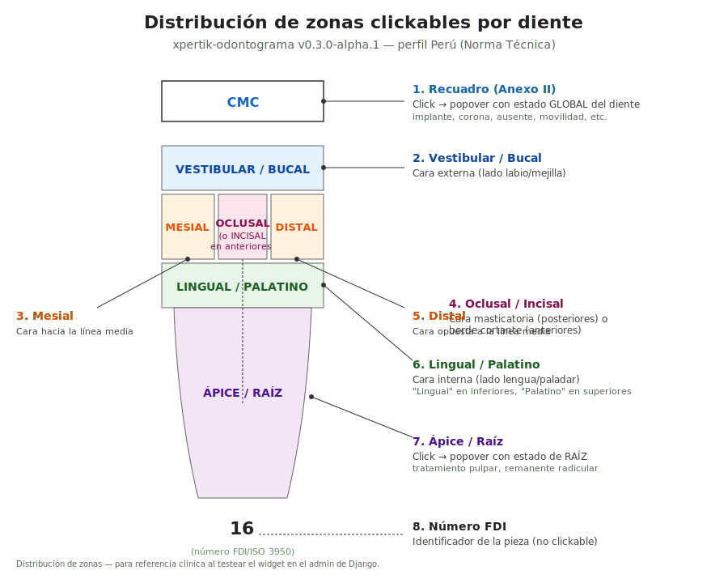

# Distribución de zonas clickables por diente

> Referencia visual de las **7 zonas interactivas** que cada diente expone
> en el widget SVG del perfil Perú (`xpertik-odontograma==0.3.0a1`). Útil
> para que el odontólogo entienda dónde clickear para registrar cada tipo
> de hallazgo.



> Si tu visor no renderea SVG inline, abrí el archivo
> [`distribucion-zonas-diente.svg`](./distribucion-zonas-diente.svg)
> directo en el browser.

---

## Diagrama ASCII (referencia rápida)

```
┌─────────────────────────────┐
│  Recuadro Anexo II          │  ← 1. Click → estado GLOBAL
│  (sigla auto-derivada)      │     (implante, corona, ausente,
└─────────────────────────────┘      movilidad, etc.)

         ┌─────────────────────┐
         │      VESTIBULAR     │  ← 2. Cara externa
         ├──────┬──────┬──────┤
         │      │      │      │
         │MESIAL│OCLUS.│DISTAL│  ← 3, 4, 5. Caras proximales y oclusal
         │      │      │      │
         ├──────┴──────┴──────┤
         │   LINGUAL/PALATINO  │  ← 6. Cara interna
         └──────────────────────┘

              ╲           ╱
               ╲   APICE  ╱        ← 7. Click → estado de RAÍZ
                ╲       ╱             (tratamiento pulpar,
                 ╲_____╱               remanente radicular)

                   16                ← 8. Número FDI (no clickable)
```

---

## Tabla de zonas

| # | Zona | Click → resultado | Nomenclaturas posibles |
| --- | --- | --- | --- |
| 1 | **Recuadro Anexo II** | Estado **GLOBAL** del diente (`tooth.estado`) | implante, corona definitiva, ausente, movilidad, fractura, extruido, intruido, etc. |
| 2 | **Vestibular / Bucal** | Estado de **CARA** (`tooth.caras.vestibular_bucal`) | caries, restauración, fractura |
| 3 | **Mesial** | Estado de **CARA** (`tooth.caras.mesial`) | caries, restauración |
| 4 | **Oclusal / Incisal** | Estado de **CARA** (`tooth.caras.oclusal_incisal`) | caries, restauración |
| 5 | **Distal** | Estado de **CARA** (`tooth.caras.distal`) | caries, restauración |
| 6 | **Lingual / Palatino** | Estado de **CARA** (`tooth.caras.lingual_palatino`) | caries, restauración |
| 7 | **Ápice / Raíz** | Estado de **RAÍZ** (`tooth.apice.estado`) | tratamiento pulpar, remanente radicular |
| 8 | Número FDI | (no clickable) | — |

---

## Reglas de exclusividad (XOR)

Un diente puede tener **EITHER**:
- Un **`estado` global** (todo el diente — ej: implante)
- O **`caras`** y/o **`apice`** (zonas específicas — ej: caries en oclusal + tratamiento pulpar en raíz)

**Nunca ambos a la vez.** El selector de la UI limpia automáticamente las
caras/ápice cuando se setea un estado global, y viceversa.

## Resolución de labels según el diente

Los labels visibles **dependen del diente concreto**, según la
nomenclatura clínica:

| Cara | Posteriores (molares/premolares) | Anteriores (incisivos/caninos) |
| --- | --- | --- |
| Cara superior | **Oclusal** | **Incisal** |
| Cara hacia mejilla/labio | **Vestibular** | Vestibular (también "labial") |
| Cara hacia lengua/paladar | **Lingual** (inferiores) / **Palatino** (superiores) | igual |
| Caras proximales | **Mesial** (hacia línea media) y **Distal** (opuesta) | igual |

Por eso el JSON usa **5 keys fijos** (`oclusal_incisal`, `mesial`,
`distal`, `vestibular_bucal`, `lingual_palatino`) y el widget resuelve el
label visible diente por diente.
